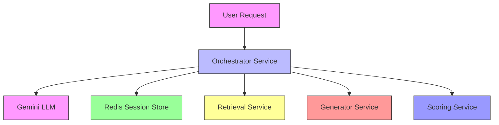
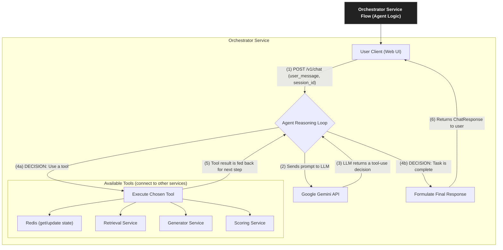
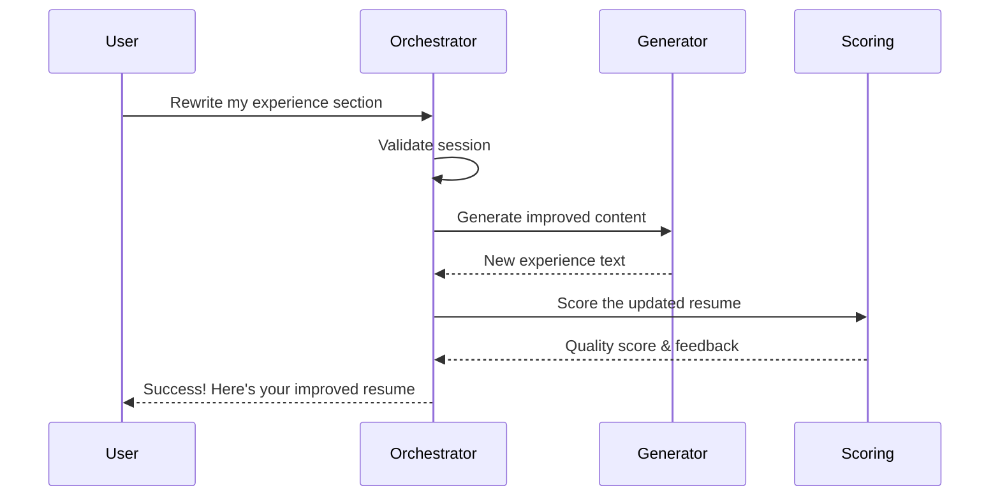

# CVisionary Orchestrator Agent Service

[](https://opensource.org/licenses/MIT)
[](https://www.python.org/downloads/)
[](https://fastapi.tiangolo.com/)
[](https://www.langchain.com/)

An intelligent, stateful microservice that serves as the central orchestrator for the CVisionary resume-building platform. This service leverages AI to understand user intents, manage conversation state, and coordinate with specialized backend services to deliver a seamless resume-building experience.

## 🚀 Overview

The Orchestrator Service is the primary interface for the CVisionary platform, providing a powerful chat-based interface for resume building and refinement. Key features include:

- Natural language understanding of complex resume-related requests
- Stateful conversation management using Redis
- Integration with specialized AI services for content generation and analysis
- Autonomous planning and execution of multi-step resume building tasks
- Real-time feedback and scoring of resume content

## 🏗️ Architecture



## 🛠️ Technology Stack

The service leverages a modern, production-ready technology stack:

-   **FastAPI**: High-performance, asynchronous web framework for the API layer.
-   **LangChain**: The core framework for building and managing the LLM-powered agent, its tools, and its memory.
-   **Google Gemini**: The advanced language model (`gemini-1.5-pro-latest`) that powers the agent's reasoning and tool-using capabilities.
-   **Redis**: Handles durable and fast session management, storing both conversation history and the in-progress resume state.
-   **Pydantic**: Provides robust data validation for API requests/responses and internal data structures.
-   **HTTPX**: Enables efficient, asynchronous communication with all downstream microservices.

## Architecture & Core Concepts

The Orchestrator Service is the central coordinator in a microservices ecosystem. It receives user requests, uses an LLM agent to decide on a course of action, and calls other services to execute specific tasks like data retrieval, content generation, or scoring.



## 🧠 Core Components

### 1. LangChain Agent

The service's intelligence is powered by a LangChain agent that follows a structured workflow:

1. **Generate**: Create content using the Generator Service
2. **Update**: Save the generated content to the session state
3. **Score**: Evaluate the content against the job description
4. **Decide**: Determine if the content meets quality standards

### 2. Session Management

State is maintained using Redis with two key components:

- **Conversation History**: Tracks the dialog between user and agent
- **Session Context**: Maintains the current state of the resume being built

### 3. Tool Integration

The agent interacts with external services through a set of specialized tools:

| Tool | Description |
|------|-------------|
| `retrieve_context_tool` | Fetches relevant user profile information |
| `generate_text_tool` | Generates new resume content |
| `score_resume_text_tool` | Evaluates resume quality |
| `update_resume_in_memory_tool` | Saves changes to the resume state |
-   `generate_text_tool`: Calls the **Generator Service** to create new or revised text for a resume section.
-   `get_full_resume_text_tool`: Compiles the entire resume from Redis into a single string, which is required for the scoring tool.
-   `score_resume_text_tool`: Calls the **Scoring Service** to get a match score and identify missing keywords.
-   `get_improvement_suggestions_tool`: Calls the **Scoring Service** to get AI-powered improvement tips if the score is low.
-   `update_resume_in_memory_tool`: **A critical step.** The agent uses this tool to save newly generated content back into the `resume_state` in Redis.

## 🚀 Getting Started

### Prerequisites

- Python 3.9+
- Redis server
- Google Gemini API key
- Running instances of all CVisionary microservices

### Local Development Setup

1. **Clone the repository**
   ```bash
   git clone https://github.com/your-org/cvisionary.git
   cd cvisionary/Agent/orchestrator
   ```

2. **Set up a virtual environment**
   ```bash
   # Windows
   python -m venv venv
   .\venv\Scripts\activate
   
   # Unix/MacOS
   python3 -m venv venv
   source venv/bin/activate
   ```

3. **Install dependencies**
   ```bash
   pip install -r requirements.txt
   ```

4. **Configure environment**
   Create a `.env` file with the following variables:
   ```env
   # Core Configuration
   GEMINI_API_KEY=your_api_key_here
   REDIS_URL=redis://localhost:6379
   
   # Service Endpoints
   GENERATION_SERVICE_URL=http://localhost:8003
   RETRIEVAL_SERVICE_URL=http://localhost:8002
   SCORING_SERVICE_URL=http://localhost:8004
   
   # Application Settings
   LOG_LEVEL=INFO
   DEBUG=false
   ```

5. **Run the service**
   ```bash
   uvicorn app:app --host 0.0.0.0 --port 8080 --reload
   ```
   
   The API documentation will be available at:  
   http://localhost:8080/docs

## 📚 API Reference

### Chat Endpoint

#### `POST /v1/chat`

Primary endpoint for interacting with the resume-building agent.

**Request Body (JSON):**

| Field | Type | Required | Description |
|-------|------|----------|-------------|
| `session_id` | string | Yes | Unique identifier for the conversation |
| `user_message` | string | Yes | The user's input message |
| `user_id` | string | First msg | User identifier |
| `job_description` | string | First msg | Target job description |

**Example Request:**

```bash
curl -X POST "http://localhost:8080/v1/chat" \
-H "Content-Type: application/json" \
-d '{
  "session_id": "unique-session-123",
  "user_message": "Create a resume for a senior developer position.",
  "user_id": "user-456",
  "job_description": "Looking for an experienced developer with Python and cloud experience..."
}'
```

**Success Response (200 OK):**

```json
{
  "agent_response": "I've created a draft resume for you. Let me know if you'd like to make any changes!",
  "session_id": "unique-session-123",
  "resume_state": {
    "summary": "Results-driven Senior Developer with 7+ years of experience...",
    "experience": [
      {
        "title": "Senior Software Engineer",
        "company": "Tech Corp Inc.",
        "duration": "2020-Present",
        "achievements": [
          "Led a team of 5 developers...",
          "Reduced API response time by 40%..."
        ]
      }
    ]
  }
}
```

**Error Responses:**

- `400 Bad Request`: Missing required fields or invalid input
- `500 Internal Server Error`: An unexpected error occurred

### Health Check

#### `GET /health`

Verify service health and dependencies.

**Response:**

```json
{
  "status": "healthy",
  "service": "orchestrator-service",
  "redis_connected": true,
  "version": "1.0.0",
  "timestamp": "2025-06-22T10:00:00Z"
}
```

## 🔄 Workflow Example

### Rewriting a Resume Section

1. **User Request**  
   *"Rewrite my experience section to better match the job description."*

2. **Agent Processing**
   - Validates session and retrieves conversation history
   - Identifies the need to update the experience section
   
3. **Context Retrieval**  
   Fetches relevant user data and previous resume content
   
4. **Content Generation**  
   Creates improved content using the Generator Service
   
5. **Quality Assurance**
   - Saves the new content
   - Scores it against the job description
   - Makes improvements if needed
   
6. **Response**  
   Returns the updated resume with a success message



## 📁 Project Structure

```
orchestrator/
├── .env                     # Environment configuration (gitignored)
├── requirements.txt         # Python dependencies
├── README.md                # This documentation
└── app/
    ├── __init__.py          # Package initialization
    ├── app.py               # FastAPI application and routes
    ├── agent.py             # LangChain agent implementation
    ├── tools.py             # Agent tool definitions
    ├── memory.py            # Redis session management
    ├── schemas.py           # Pydantic models
    └── config.py            # Application configuration
```

## 🛠️ Development

### Running Tests

```bash
pytest tests/
```

### Code Style

This project uses `black` for code formatting and `flake8` for linting:

```bash
black .
flake8 .
```

## 🤝 Contributing

1. Fork the repository
2. Create a feature branch
3. Make your changes
4. Submit a pull request

## 📄 License

This project is licensed under the MIT License - see the [LICENSE](LICENSE) file for details.