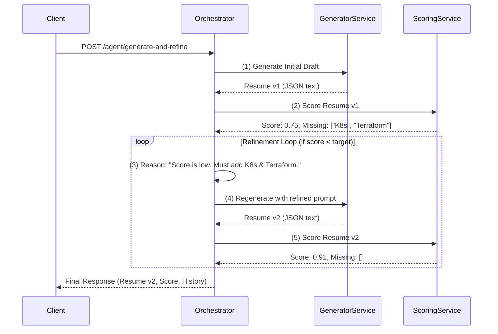

Of course. Here is a detailed, professional README file for the Orchestrator service. It explains its unique agentic nature, how it works, and how to set it up and use it effectively.

---

# CVisionary Agentic Orchestrator

[](https://opensource.org/licenses/MIT)
[](https://www.python.org/downloads/)
[](https://fastapi.tiangolo.com/)

An intelligent, autonomous agent that orchestrates the CVisionary microservices to generate and iteratively refine resumes until they meet a specified quality standard. This service transforms a simple content generation pipeline into a goal-oriented, self-correcting system.

## Overview

The Agentic Orchestrator is the "brain" of the CVisionary ecosystem. Instead of just following a static set of instructions, it operates on a dynamic, goal-driven loop. Its primary objective is not just to create a resume, but to create a *high-scoring* resume. It does this by generating content, evaluating its own work using the Scoring Service, and then reasoning about the feedback to plan and execute targeted improvements.

This service is the key to producing truly high-quality, tailored output that goes beyond a single-pass generation.

## 🧠 Core Concepts & Architecture

The orchestrator operates on a classic agentic loop: **Observe -> Evaluate -> Reason -> Refine**.

1.  **Generate (Initial Action):** It first calls the `Generator Service` to produce an initial draft of the resume based on the user's profile and the target job description.
2.  **Evaluate (Observe):** It then sends this draft to the `Scoring Service` to get an objective, quantitative analysis—the final score, semantic score, keyword score, and a list of missing keywords.
3.  **Reason (Plan):** The agent compares the current score to its `target_score`. If the score is too low, it analyzes the feedback, specifically the `missing_keywords`, to understand *why* the score is low. It then formulates a new, more specific prompt for the generator, instructing it to focus on the identified weaknesses.
4.  **Refine (Act):** It calls the `Generator Service` again with the new, improved prompt, creating a refined version of the resume.
5.  **Repeat:** The loop continues until the target score is met or the maximum number of refinement attempts is reached.

### System Flow Diagram



## 🚀 Technology Stack

-   **FastAPI**: For the web framework and API endpoints.
-   **Pydantic**: For robust data validation and schema definition.
-   **HTTPX**: For efficient, asynchronous communication with downstream services.
-   **Python-dotenv**: For managing environment variables.

## 🛠️ Getting Started

### Prerequisites

-   Python 3.9+
-   All downstream CVisionary services must be running and accessible:
    -   `embedding-service`
    -   `retrieval-service`
    -   `generator-service`
    -   `scoring-service`

### Local Setup

1.  **Clone the repository and navigate to the service directory:**
    ```bash
    git clone <repository-url>
    cd <repository-directory>/orchestrator
    ```

2.  **Create and activate a virtual environment:**
    ```bash
    python -m venv venv
    source venv/bin/activate  # On Windows, use `venv\Scripts\activate`
    ```

3.  **Install dependencies:**
    ```bash
    pip install -r requirements.txt
    ```

4.  **Configure Environment Variables:**
    Create a `.env` file in the `orchestrator/` directory. You can copy the contents of `.env.example`.

    ```env
    # .env
    # The port this orchestrator service will run on
    PORT=8005

    # REQUIRED: URLs of the downstream services
    GENERATOR_SERVICE_URL="http://localhost:8003"
    SCORING_SERVICE_URL="http://localhost:8004"

    # Agentic Loop Configuration
    AGENT_TARGET_SCORE=0.88
    AGENT_MAX_REFINEMENTS=2
    LOG_LEVEL="INFO"
    ```

5.  **Run the service:**
    ```bash
    uvicorn app.main:app --host 0.0.0.0 --port 8005 --reload
    ```
    The service will be available at `http://localhost:8005`. The API documentation can be found at `http://localhost:8005/docs`.

## 📚 API Documentation

### Main Endpoint

#### Generate and Refine Resume
Triggers the full agentic process. The agent will work autonomously until it meets its goal or runs out of attempts.

-   **Endpoint:** `POST /agent/generate-and-refine`
-   **Request Body:**

    ```json
    {
      "user_id": "string",
      "job_description": "string",
      "target_score": "float (optional)",
      "max_refinements": "integer (optional)"
    }
    ```
    -   `user_id`: The user's profile to use for context.
    -   `job_description`: The target job posting.
    -   `target_score` (optional): Override the default `AGENT_TARGET_SCORE` for this specific request.
    -   `max_refinements` (optional): Override the default `AGENT_MAX_REFINEMENTS` for this request.

-   **cURL Example:**

    ```bash
    curl -X 'POST' \
      'http://localhost:8005/agent/generate-and-refine' \
      -H 'Content-Type: application/json' \
      -d '{
        "user_id": "user-123-test",
        "job_description": "We are hiring a Senior Cloud & DevOps Engineer with expertise in AWS, Kubernetes, and Terraform. Responsibilities include designing robust CI/CD pipelines using GitLab CI and managing containerized applications with Docker.",
        "target_score": 0.90
      }'
    ```

-   **Success Response (200 OK):**
    The response provides the final result along with a full audit trail of the agent's process.

    ```json
    {
      "status": "Completed: Target score of 0.9 met or exceeded.",
      "final_resume": {
        "summary": "A highly skilled Cloud & DevOps Engineer...",
        "experience": [...],
        "skills": { "technical": ["AWS", "Kubernetes", ...], "soft": [...] }
      },
      "final_score": 0.925,
      "refinement_history": [
        {
          "attempt": 0,
          "reasoning": "Initial draft generation.",
          "final_score": 0.781,
          "semantic_score": 0.82,
          "keyword_score": 0.75,
          "missing_keywords": ["Kubernetes", "Terraform"]
        },
        {
          "attempt": 1,
          "reasoning": "Refining based on low score. Key missing keywords: Kubernetes, Terraform.",
          "final_score": 0.925,
          "semantic_score": 0.91,
          "keyword_score": 0.94,
          "missing_keywords": []
        }
      ]
    }
    ```
    -   `refinement_history`: This array is the proof of the agent's work, showing its reasoning and the score improvement at each step.

### Utility Endpoints
-   `GET /health`: A simple health check endpoint.

## ⚙️ Configuration

The agent's behavior can be tuned via environment variables in the `.env` file:

| Variable                | Description                                                              | Default |
| ----------------------- | ------------------------------------------------------------------------ | ------- |
| `PORT`                  | The port on which the orchestrator service runs.                         | `8005`  |
| `GENERATOR_SERVICE_URL` | The full URL of the running `generator-service`.                         | `n/a`   |
| `SCORING_SERVICE_URL`   | The full URL of the running `scoring-service`.                           | `n/a`   |
| `AGENT_TARGET_SCORE`    | The minimum score the agent aims for before stopping.                    | `0.88`  |
| `AGENT_MAX_REFINEMENTS` | The maximum number of improvement loops the agent will attempt.          | `2`     |
| `LOG_LEVEL`             | The logging level for the service (e.g., `INFO`, `DEBUG`).               | `INFO`  |

## ⚠️ Error Handling

-   `502 Bad Gateway`: This indicates that a downstream service (`Generator` or `Scorer`) is either unavailable or returned a server-side error. Check the logs of the downstream services for more details.
-   `500 Internal Server Error`: An unexpected error occurred within the orchestrator's agentic loop. Check the orchestrator's logs.

## 📁 Project Structure

```
orchestrator/
├── .env.example          # Example environment variables
├── requirements.txt      # Python dependencies
└── app/
    ├── __init__.py
    ├── main.py           # FastAPI application, endpoint, and lifecycle
    ├── agent.py          # The core agentic loop and refinement logic
    ├── clients.py        # Functions for calling downstream services
    ├── schemas.py        # Pydantic models for the orchestrator
    └── config.py         # Configuration loading and management
```