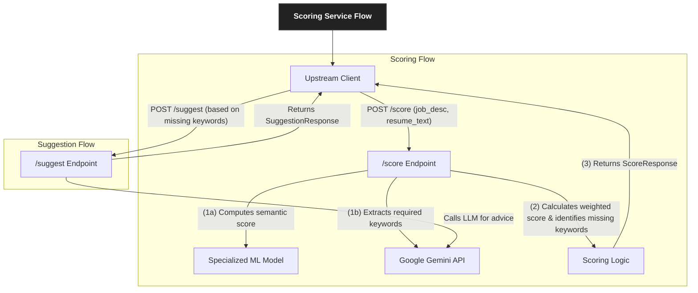

# CVisionary Scoring Service
=====================================

A high-performance FastAPI microservice for intelligent, ATS-style resume analysis against job descriptions. This service provides weighted composite match scoring, dynamic keyword identification, and AI-powered improvement suggestions.

## Overview
-----------

This is a specialized FastAPI microservice designed to perform intelligent, ATS-style analysis of resumes against job descriptions. This service provides a weighted composite match score, dynamically identifies missing keywords using an LLM, and offers AI-powered suggestions for improvement.

## Technology Stack
--------------------

*   **FastAPI**: High-performance, asynchronous web framework
*   **Sentence Transformers**: `anass1209/resume-job-matcher-all-MiniLM-L6-v2` model for semantic similarity
*   **Google Gemini**: For dynamic keyword extraction and generating intelligent suggestions
*   **Pydantic**: Data validation and API schema definitions
*   **Jinja2**: For robust and maintainable prompt templating

## Architecture & Core Concepts
-------------------------------

The Scoring Service is a self-contained analytical tool that provides on-demand resume analysis. It combines a fine-tuned ML model with a powerful LLM to deliver a nuanced and realistic score that goes beyond simple text similarity.

### Core Components

#### 1. Weighted Composite Scoring

The service calculates a final score based on a weighted average of two key metrics, mimicking how a human recruiter would evaluate a resume:

*   **Semantic Score (40% Weight):** Calculated using a specialized `resume-job-matcher` model, this score measures the contextual and conceptual alignment between the resume and the job description. It answers, "Does the resume *feel* like a good fit?"
*   **Keyword Score (60% Weight):** This score measures the presence of critical, non-negotiable hard skills. It is given a higher weight as missing a required technology (e.g., "AWS," "React") is often a disqualifying factor. It answers, "Does the resume have the specific skills I *need*?"

The final score is calculated as: `(semantic_score * 0.4) + (keyword_score * 0.6)`.

#### 2. LLM-Powered Keyword Analysis

Instead of relying on a fixed, brittle list of skills, the service uses the Google Gemini API to dynamically analyze any job description and extract the most critical hard skills and technologies. This makes the service highly adaptable and intelligent, capable of understanding requirements for any role.

#### 3. JSON-Driven Suggestions

All interactions with the Gemini API are strictly managed via prompts that enforce a JSON output. This ensures that the suggestions provided are well-structured, reliable, and can be easily parsed and displayed by any client application, eliminating the fragility of regex-based parsing.

### System Flow



## Getting Started
-------------------

### Prerequisites

*   Python 3.9+
*   A Google Gemini API Key.

### Local Setup

1.  **Clone the repository and navigate to the service directory.**

2.  **Create and activate a virtual environment:**
    ```bash
    python -m venv venv
    source venv/bin/activate  # On Windows, use `venv\Scripts\activate`
    ```

3.  **Install dependencies:**
    ```bash
    pip install -r requirements.txt
    ```

4.  **Configure Environment Variables:**
    Create a `.env` file in the `scoring_service` directory:
    ```env
    # .env
    # Required for keyword extraction and suggestions
    GEMINI_API_KEY="your-google-api-key-here"
    
    # Optional: Set log level (e.g., INFO, DEBUG)
    LOG_LEVEL="INFO"
    ```

5.  **Run the service:**
    This service is designed to run on port `8004` to avoid conflicts with other ecosystem services.
    ```bash
    uvicorn scoring_service.app:app --host 0.0.0.0 --port 8004 --reload
    ```
    The service will be available at `http://localhost:8004`. The API documentation can be found at `http://localhost:8004/docs`.

## API Documentation
---------------------

### Core Endpoints

#### 1. Score Resume

Analyzes a resume against a job description and returns the composite score and keyword analysis.

*   **Endpoint:** `POST /score`
*   **cURL Example:**
    ```bash
    curl -X 'POST' \
      'http://localhost:8004/score' \
      -H 'Content-Type: application/json' \
      -d '{
        "job_description": "We are looking for a Senior Python Developer with 5+ years of experience in building scalable web applications using FastAPI and AWS. Experience with Docker, Kubernetes, and CI/CD pipelines is a plus.",
        "resume_text": "Senior Software Engineer with 6 years of experience. Proficient in Python, Django, and cloud services. Led a team to develop microservices using Docker and AWS. Strong problem-solving skills and experience with Agile methodologies."
      }'
    ```
*   **Success Response (200 OK):**
    ```json
    {
      "final_score": 0.856,
      "semantic_score": 0.78,
      "keyword_score": 0.9,
      "missing_keywords": ["FastAPI", "Kubernetes"]
    }
    ```

#### 2. Get Suggestions

Generates personalized suggestions for improving a resume based on missing keywords.

*   **Endpoint:** `POST /suggest`
*   **cURL Example:**
    ```bash
    curl -X 'POST' \
      'http://localhost:8004/suggest' \
      -H 'Content-Type: application/json' \
      -d '{
        "missing_keywords": ["FastAPI", "Kubernetes"]
      }'
    ```
*   **Success Response (200 OK):**
    ```json
    {
      "suggestions": [
        "Consider adding a project that demonstrates your experience with FastAPI, such as building a RESTful API with authentication and database integration.",
        "If you have experience with container orchestration, be sure to highlight any work with Kubernetes, including any deployments or scaling configurations you've managed.",
        "You can enhance your skills section by explicitly listing 'FastAPI' and 'Kubernetes' if you have familiarity with their concepts."
      ]
    }
    ```

### Utility Endpoints

*   `GET /health`: A simple health check endpoint.

## Project Structure
---------------------

```
scoring/
├── .env                    # Environment variables
├── requirements.txt         # Dependencies
├── app.py                  # Main FastAPI application and endpoints
├── feature_extractor.py    # Logic for LLM-based keyword extraction
├── llm_client.py           # Client for Google Gemini API
├── model_inference.py      # Handles loading and running the semantic scoring model
├── schemas.py              # Pydantic models for API validation
└── suggestion_client.py    # Logic for generating suggestions via LLM